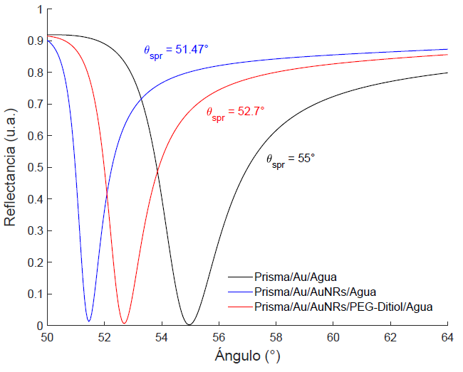

### Biosensor
## Herramientas para modelar el funcionamiento de un biosensor SPR en la configuración Kretschmann-Rather

Este repositorio contiene programas que pueden ayudar en el desarrrollo de la modelación de la respuesta óptica de un sensor SPR 

El contenido del repositorio es el siguiente

- Cálculo de la reflectancia para un sistema de 3 capas sustrato/película/ambiente [fresnel1](fresnel1.m) 

- Cálculo de la reflectancia para un sistema de 4 capas sustrato/película/AuNRs/ambiente [fresnel2](fresnel2.m) 

- Cálculo de la reflectancia para un sistema de 5 capas sustrato/película/medio dieléctrico/AuNRs/ambiente [fresnel3](fresnel3.m) 

- Cálculo de coeficientes de Mie [Mie_abcd](Mie_abcd.m) 

- Cálculo de eficiencias [Mie](Mie.m) 

- Cálculo de curva de absorbancia AuNPs [absorbancia1](absorbancia1.m) 

- Cálculo de curva de absorbancia AuNRs [absorbancia2](absorbancia2.m) 

- Correción de función dieléctrica del oro para NPs [correcionnanometrica](correcionnanometrica.m) 

A modo de resultado, se muestra una imagen de la simulación con el programa  [fresnel3](fresnel3.m) 

